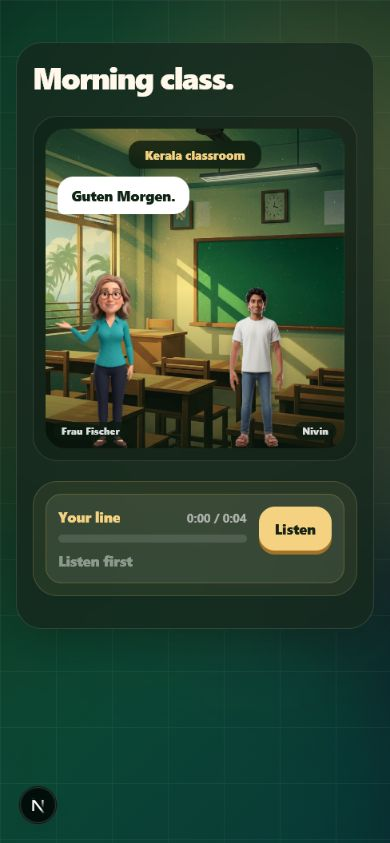
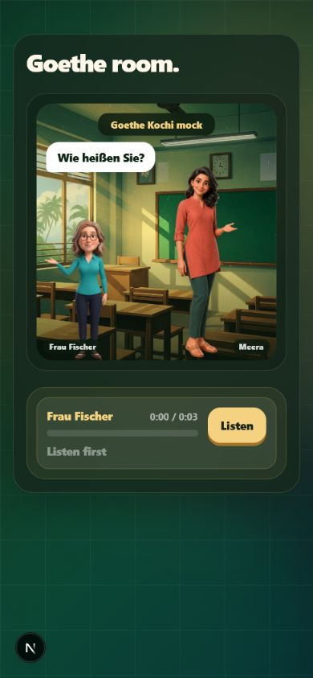

# Fixed-cast migration contract

Status: `3p-06` implementation; owner review pending.

## Owner-review previews

Both shipping conversation layouts were checked at a 390 × 844 phone viewport. The page width remains 390 px with no horizontal overflow, and no legacy cast name is visible.

| Nivin + Frau Fischer | Meera + Frau Fischer |
|---|---|
|  |  |

## Canonical shipping cast

- Nivin and Meera are equal adult Malayali learner peers.
- Frau Fischer is the recurring teacher.
- Appu is a rare silent UI mascot, not a speaker, teacher, learner, status messenger, or repeated CTA decoration.
- The real learner's optional preferred name remains separate and is never baked into pre-rendered audio or video.

No age, district, degree, occupation, destination path, surname, or other résumé detail is fixed for Nivin or Meera. Role-play cards and grammar examples must be labelled as editable examples rather than inherited biography.

## Ownership

The 91 active legacy story lessons now declare `storyScene.learnerOwner`. Ownership alternates Nivin → Meera inside every module. Renderers use that field for the portrait, label, intro, reactions, and conclusion.

The current Module 1 recording scripts use the same strict alternation:

| Lesson | Owner |
|---|---|
| 1 | Nivin |
| 2 | Meera |
| 3 | Nivin |
| 4 | Meera |
| 5 | Nivin |
| 6 | Meera |
| 7 | Nivin |

## Documented compatibility IDs

These old strings may remain only as implementation compatibility IDs. They are never learner-facing names:

- `kuttan-*.png` is the accepted adult Nivin compatibility asset family.
- `frau-weber-*.png` is the accepted Frau Fischer compatibility asset family.
- `Kuttan.tsx`, `KuttanImage.tsx`, `KuttanSpeech.tsx`, and `FrauWeber.tsx` are deprecated re-export shims.
- `greetFrauWeber` and `/missions/module-1/greet-frau-weber` remain persisted mission/link compatibility IDs; the visible teacher is Frau Fischer.
- The code mapping is authoritative in `src/lib/cast.ts`.

The approved Meera production cutout ships byte-exactly at `public/images/characters/meera-presenting.png`.

## Spoken-name and production migration

- Module 2 self-introduction and spelling models now say Meera and use `M-E-E-R-A`.
- The three live On the Go episodes were rebuilt from migrated source props.
- Module 1's spoken teacher-address clip now says Frau Fischer.
- Superseded Kuttan-name mission audio files were removed; git history remains the recovery source.
- Current Module 1 scripts, storyboards, rubrics, wiring specs, TTS props, and video definitions use the fixed cast.

## Non-authoritative legacy surfaces

Historical decisions/evidence and generated script outputs are not rewritten. The frozen `src/remotion/` proof and legacy `src/app/games/` suite remain outside this chunk and must not be treated as current recording or cast authority. Any future route that promotes one of those surfaces into the launch path must first consume `src/lib/cast.ts` and pass the fixed-cast migration gate.
